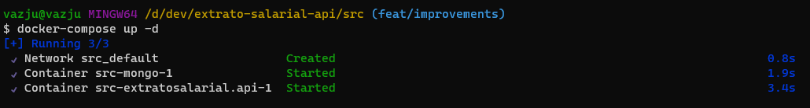
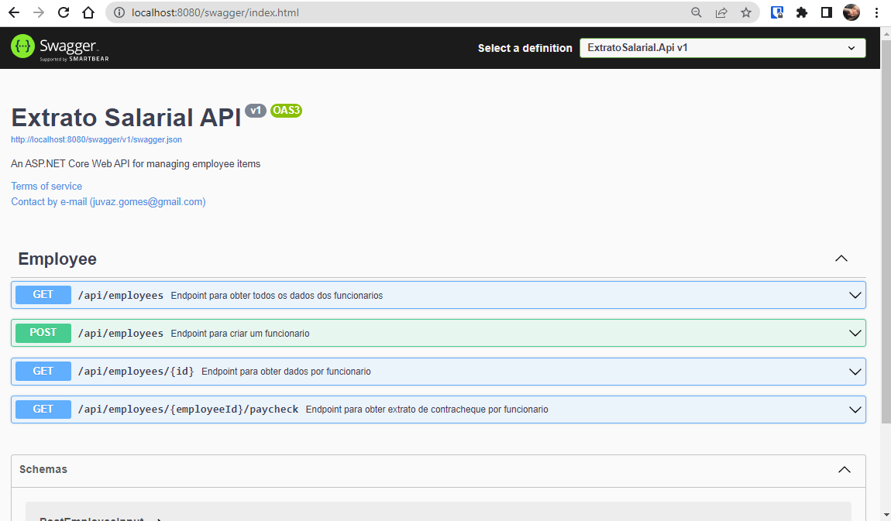

# Api de Extrato Salarial

<p align="center">
  <a href="#about">Sobre o projeto</a> •
  <a href="#packages-tech">Pacotes e tecnologias utilizados no projeto</a> •
  <a href="#installation">Instalação</a> •
  <a href="#build-exec">Build e Execução</a> •
  <a href="#references">Referências e Links</a> •
  <a href="#author">Autor</a>
</p>


## <a name="about"></a>Sobre o projeto
O projeto consiste em desenvolver uma Web Api responsável por criar o extrato da folha salarial dos funcionários, incluindo o salário líquido e os descontos.

## <a name="packages-tech"></a>Pacotes e tecnologias utilizadas no projeto

- Docker
- Github Actions
- Moq (4.18.4)
- XUnit (2.4.2)
- .Net Core (6.0) 
- MongoDB.Driver (2.19.2)
- FluentValidation (11.5.2)
- Swagger - Swashbuckle.AspNetCore (6.2.3)

## <a name="installation"></a>Instalação

### 1. Clone do projeto

Realize a instalação do GIT para conseguir executar as próximas etapas de instalação:

* **[GIT](https://git-scm.com/downloads)**

Será necessário realizar o clone do repositório para a execução em sua máquina local. Digite o comando abaixo em seu terminal:

```
git clone https://github.com/juliavaz/extrato-salarial-api.git
```

### 2. Download Docker

Realize a instalação do Docker seguindo a [documentação oficial](https://www.docker.com/).


## <a name="build-exec"></a> Build e Execução

O comando a seguir irá inicializar um container docker, no qual é responsável por instalar todas as dependências necessárias, junto a outro container de banco de dados para a utilização da api.

Digite o comando abaixo em seu terminal, dentro do diretório `src/`
```
docker compose up -d
```



Para executar a api, entre na url [http://localhost:8080/swagger/index.html](http://localhost:8080/swagger/index.html)

Para uma melhor experiência, inicie criando um funcionário pelo `POST - api/employees` dessa forma terá acesso aos outros endpoints.



## <a name="references"></a> Referências e Links

- [Docker Compose](https://docs.docker.com/get-started/02_our_app/)
- [MongoDB Driver](https://www.mongodb.com/docs/drivers/csharp/current/quick-start/#create-a-mongodb-cluster)
- [Fluent Validation](https://docs.fluentvalidation.net/en/latest/index.html#example)
- [Aprimorando a documentação com anotações - I, II ](https://macoratti.net/22/04/swagger_aprdoc1.htm)
- [Além do Fact com xUnit](https://medium.com/thiagobarradas/alem-do-fact-com-xunit-dotnet-6a52b69a50d2)
- [Code Coverage Summary - Github Actions](https://github.com/marketplace/actions/code-coverage-summary)
- [Análise local de cobertura de testes - Extension Fine Code Coverage](https://marketplace.visualstudio.com/items?itemName=FortuneNgwenya.FineCodeCoverage2022)

## <a name="author"></a>Autor
<table>
  <tr>
    <td align="center">
        <a href="https://github.com/juliavaz">
            <br/>
            <sub><b>Júlia Vaz</b></sub>
        </a><br />
    </td>
  </tr>
</table>